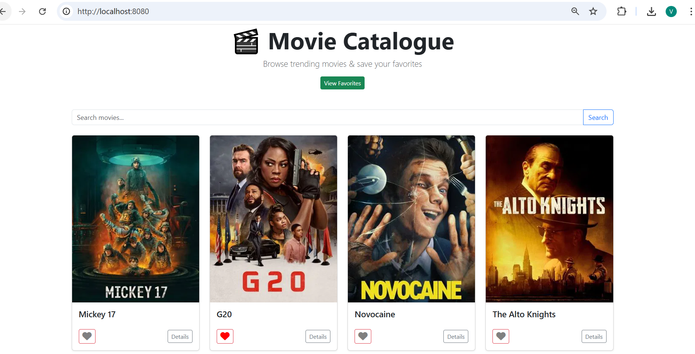
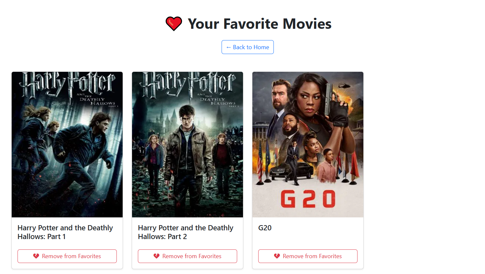

# 🎬 Movie Catalogue System

A responsive web application built using **Java Spring Boot** that fetches real-time movie data from **The Movie Database (TMDb)** API. Users can browse trending and searched movies, view detailed information, and add/remove movies from a favorites list, all stored in an in-memory **H2 database**.

---

## 🚀 Features

- 🔍 **Search** for any movie by title
- 📈 **View trending movies** on homepage
- 📝 **Detailed movie page** with poster, rating, overview, release date
- ❤️ **Add or remove favorites**
- 🧠 **Favorites are stored** in-memory using H2 database
- 🔥 **Dynamic UI feedback**:
  - Heart icons turn red when favorited ❤️
- 🖼️ Graceful fallback if a movie has no poster

---

## 🛠️ Tech Stack

- **Java 17**
- **Spring Boot**
- **Thymeleaf**
- **Bootstrap 5**
- **H2 Database**
- **TMDb API** (via `RestTemplate`)
- **Font Awesome** (icons)

---

## 📸 Screenshots

| Home View | Detail Page | Favorites Page |
|-----------|-------------|----------------|
|  |  |  |

---

## 🧪 Getting Started

### Prerequisites

- Java 17+
- Maven

### Steps

1. Clone the repository:
   ```bash
   git clone https://github.com/your-username/movie-catalogue-system.git
   cd movie-catalogue-system

2. mvn spring-boot:run

3. Open in browser: http://localhost:8080


